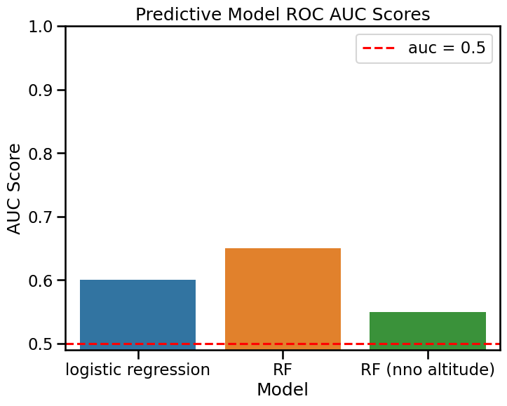
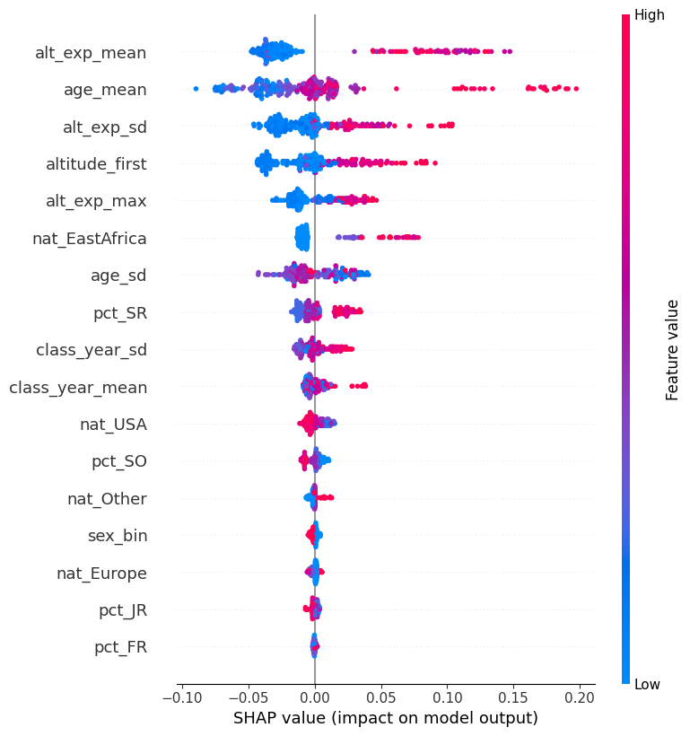
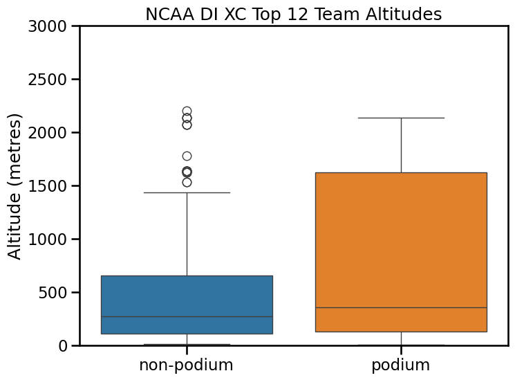
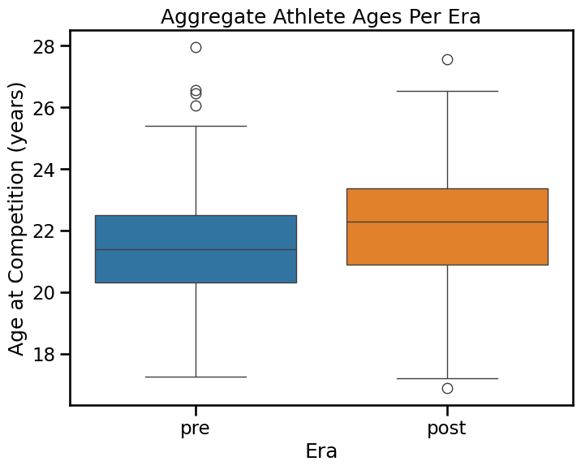

# Executive Summary
This project evaluates whether structural team characteristics demonstrate interpretable predictive characteristics for podium outcomes at NCAA Division I Cross Country Championships (2015–2025). Using a longitudinal dataset spanning 240 team observations and ~1,680 athletes (both sexes), I developed predictive models with Leave-One-Year-Out (LOYO) cross-validation to ensure realistic generalization to unseen competition years. The objective was not only to develop a predictive model, but to identify and interpret structural features that consistently contribute predictive signal. Emphasis was placed on validation discipline, interpretable modeling, and transparent assessment of feature contributions.
## Key Results
- Random Forest achieved mean AUC = 0.649, modestly outperforming logistic regression (AUC = 0.60)
- Removing altitude-related features reduced AUC to 0.549, indicating meaningful predictive contribution
- SHAP analysis identified altitude exposure and mean team age as consistent contributors
- Athlete age and nationality distributions shifted significantly following COVID-era eligibility changes
## Dataset Overview
Athlete inclusion was determined using official NCAA Division I Cross Country Championship results from TFRRS.org. Athlete demographic characteristics were obtained from World Athletics (worldathletics.org), which provides publicly accessible athlete profiles. To ensure consistency and reproducibility, a structured data compilation workflow was developed, including standardized formatting rules and validation checks throughout the compilation process. 

Ultimately, the top 12 teams across 10 years (2015-2019, 2021-2025; no competitive results from 2020 due to COVID) for both sexes were compiled and delineated via sex. Athlete characteristics included: name, date of birth (if only a year was provided, a date of July 1st, XXXX was assumed), nationality (as listed on World Athletics), academic class and associated school name at time of competition (academic classes [FR, SO, JR, SR], taken from TFRRS.org results).
## Feature Engineering and Variable Design
Campus altitude (meters) was assigned to each school using publicly available geographic elevation data. Each athlete was assigned their school's campus altitude for the corresponding competition year. 

Academic class was encoded numerically: 
- FR = 1
- SO = 2
- JR = 3
- SR = 4 

To capture cumulative environmental exposure, an engineered variable called altitude exposure was calculated:
altitude_exposure = campus_altitude x years_of_exposure

Where:
years_of_exposure = academic_class - 1 

"years_of_exposure" was calculated as such, for 2 reasons:
1. Athlete transfer history is not consistently available, so cumulative exposure cannot be precisely reconstructed.
2. NCAA Cross Country Championships occur early in the academic year, meaning first-year athletes have limited exposure to their institution's altitude at the time of competition.
  
Nationality was grouped into 4 coarse bins: 
- USA
- Europe
- East Africa
- Other (any country not directly assigned to one of the three aforementioned bins).

These bins were used to assess structural representation patterns and their potential association with team-level outcomes.

Following completion of an athlete-level data set, a team-aggregated data set was constructed, using Year, Sex, Campus, and Team Placing as unique identifiers. 

Team-level structural variables include:
- Mean athlete age
- Athlete age standard deviation
- Proportion of athletes in each academic class
- Proportion of athletes in each nationality bin
- Campus altitude
- Altitude exposure summary statistics (mean, max, standard deviation)

## Modeling Strategy
The binary outcome of interest was whether or not a team finished on the podium (top 4 teams at NCAA XC). Therefore, each team observation was assigned a binary target variable:
- podium = 1 if placing <= 4
- podium = 0 otherwise

Two model classes were evaluated: logistic regression (baseline linear model) and Random Forest (nonlinear model)

All models were evaluated using Leave-One-Year-Out (LOYO) cross-validation, where models were trained on nine championship years and evaluated on the held-out year. Model performance was assessed using ROC-AUC score. To quantify the contribution of altitude-related features, three Random Forest variants were evaluated:
- Full model (all features included)
- Altitude exposure variables removed (campus altitude retained)
- All altitude-related variables removed

This approach allows for direct measurement of the predictive contribution of altitutde-related features.

SHAP values were computed for the full Random Forest model to interpret feature contributions and assess potential nonlinear relationships between structural variables and model predictions.

## Model Performance

A random forest model's improved performance relative to a logistic regression model including all variables (aucs: 0.6 vs. 0.65) suggests the presenece of non-linear feature interactions. The all-feature random forest model performed meaningfully better than a random forest with altitude values ommitted (aucs: 0.55 vs. 0.65), suggesting altitude to carry meaningful predictive signal. While overall predictive performance remains modest, the consistent performance drop following ablation supports the presence of some interpretable structural signal.

## Model Interpretation

SHAP (SHapley Additive exPlanations) values were used to interpret feature contributions in the full Random Forest model. Each point in the summary plot represents a single team observation. The horizontal position indicates the feature’s contribution to the model prediction, while color reflects the magnitude of the feature value. Positive SHAP values indicate features that increase the model’s predicted probability of podium placement, while negative values indicate features that decrease predicted probability. Altitude-related variables consistently ranked among the most influential features, along with mean team age and nationality representation variables. However, individual SHAP magnitudes were generally small, reflecting the modest predictive performance of the model. This is expected given:
- Limited dataset size (240 team observations)
- Absence of potentially relevant variables, such as training program characteristics, athlete performance history, recruitment metrics/strategy

These results suggest that structural features carry interpretable signal, but do not fully explain podium outcomes. Therefore, model predictions reflect only probabilistic tendencies, rather than deterministic factors.

## Altitude Comparison

Campus altitude distributions were compared between podium and non-podium teams. Podium teams were more frequently associated with higher campus altitudes, with a visibly higher upper-quartile range compared to non-podium teams. This descriptive pattern is consistent with the predictive modeling results, where removal of altitude-related variables reduced model performance. While altitude alone does not determine outcomes, the consistency between descriptive comparisons and model ablation results supports the presence of interpretable structural signal associated with institutional altitude. This relationship likely reflects broader structural and institutional factors rather than a direct causal effect of altitude itself, but further exploration is warranted.

## Structural Distribution Shifts

These data were tangentially aggregated (per athlete per era) to answer a secondary question: Has there been a shift in mean athlete age from pre-post COVID (and, if so, are there any intra-era trends in age post COVID)?

- Pre-COVID (2015–2019) Median age = 21.4
- Post-COVID (2021–2025) Median age = 22.3

A Mann–Whitney U test confirmed a significant shift in age distributions:
- p < 0.001
- Effect size (r) = 0.23

This indicates that athletes on top-12 team rosters were approximately one year older on average in the post-COVID era. To evaluate whether this represented a temporary disruption or a persistent shift, linear regression was performed across post-COVID years (2021–2025). The standardized regression coefficient for year was small (β = 0.013), indicating no meaningful trend toward younger or older rosters during this period. These results suggest a structural shift in roster age composition following COVID-era eligibility disruptions, rather than a temporary deviation returning to prior norms. While eligibility extensions likely contributed substantially, the persistence of elevated age distributions suggests additional structural or institutional factors may also play a role.

## Limitations
- Dataset limited to top 12 teams per year
- Sample size modest (240 team observations)
- Results probabilistic, not causal
- Potential unmeasured confounders (training environment, coaching continuity, recruitment dynamics)
- Nationality binning simplifies complex demographics

The project prioritizes structural pattern detection rather than causal inference.

### Nationality Variable Framing
Nationality was included as a structural variable to evaluate representation patterns across championship teams. These groupings reflect commonly used geographic categories in sports analytics and were used solely to assess changes in representation and potential association with team-level outcomes. This analysis does not make causal claims regarding athlete ability or performance. Observed associations likely reflect a complex combination of institutional, developmental, and recruitment factors rather than individual-level determinants. The purpose of including nationality was to examine structural patterns in longitudinal data, not to attribute performance to inherent characteristics.

### Practical Takeaways
This project demonstrates several applied machine learning principles relevant to real-world analytics workflows:
- Proper cross-validation design for temporally structured data
- Use of ablation testing to quantify feature contribution
- Application of SHAP to interpret model behavior
- Integration of predictive modeling with statistical analysis
- Transparent communication of model limitations

These principles are broadly applicable to healthcare, workforce, and operational analytics contexts where interpretability and validation discipline are critical.
